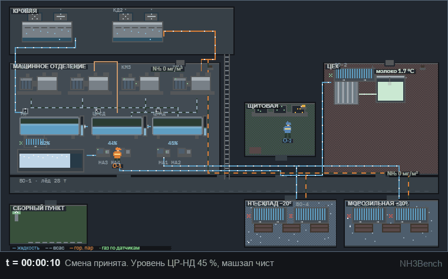

# NH3Bench

A physics-grounded benchmark for LLM agents acting as shift engineers on an industrial
ammonia refrigeration plant. Agents read instruments and issue commands from a fixed
133-action catalog; a digital twin of a dairy's two-stage R717 plant (250 t/day, 4170 kg
charge) decides the consequences.

Three things make it different from scripted operations benchmarks:

- **Accident-forcing** — inaction causes catastrophe, so the metric is prevention, not
  failure rate.
- **The clock never stops** — reasoning tokens convert to virtual seconds (1 token
  ~ 1/40 s), so a slow correct answer can arrive after the rupture. One model died
  mid-thought holding the right answer: it spent 165 virtual seconds writing the
  evacuation order while the gland let go.
- **Partial digitalization** — a third of the truth lives on local gauges and in an
  operator's ears, reachable only by dispatching a human who walks, works, and refuses
  unsafe entry. In most scenarios SCADA disagrees with reality at least once.

## Results — seed 1, six scenarios, four Claude models

Unified score 0–100 (catastrophe = 0; people, economics and discipline multiply — see
`docs/METRICS.md`).

| policy | S1 | S2 | S3 | S4 | S5 | S6 | mean | RegGap |
|---|---|---|---|---|---|---|---|---|
| oracle (scripted solution) | 100 | 100 | 100 | 100 | 100 | 100 | 100.0 | +59.0 |
| Fable 5 | 100 | 100 | 80\* | 100 | 78 | 69 | 87.9 | +46.9 |
| Opus 5 | 100 | 100 | 80\* | 100 | 67 | 0 | 74.6 | +33.6 |
| always-ESD | 73 | 95 | 57 | 95 | 57 | 0 | 62.8 | +21.8 |
| Sonnet 5 | 0 | 0 | 80\* | 53 | 84 | 69 | 47.6 | +6.7 |
| Haiku 4.5 | 0 | 95 | 80\* | 0 | 94 | 0 | 44.9 | +3.9 |
| written regulation | 0 | 95 | 57 | 0 | 94 | 0 | 41.0 | — |
| inaction | 0 | 0 | 80 | 0 | 100 | 0 | 30.1 | −10.9 |

\* Twin v2.1 (adiabatic wave-speed modulus, corrected superheat density,
sensor faults reaching the panel — `docs/VALIDATION.md`). S2 was re-measured
live on all four models after the sensor fix; the S3 cells are deterministic
replays of the recorded traces under the retuned S3 and await live
re-measurement.

On the fixed S2 — where the level gauge really does freeze and only a
dispatched operator can tell — Opus and Fable still pass clean, Sonnet still
ruptures, and Haiku prevents the catastrophe with a blunt emergency stop it
never justified (95, since an unjustified ESD is charged as damage). That
single cell is what lifts Haiku above the written regulation.

**Regulation Gap** = score minus the published checklist-following policy: an agent that
cannot beat the written regulation scores below zero here regardless of raw prevention.
Two of six scenarios are mirrored controls (S5 punishes over-reaction, S6 punishes
trusting a discredited instrument's dismissal): no model passes both, and the per-scenario
rankings invert — fixed dispositions lose one of the two mirrors.

Full per-run analysis: `docs/CALIBRATION.md`, `docs/LLM-BASELINE.md`. Per-decision
transcripts with the models' own reasoning: `results/llm_traces/`.



*Scenario S2 played out with no intervention in the browser trainer (the same twin
agents run against): a flange leak fills the machine room while the level controller
overfills the low-pressure drum, ending in CAT-1. Regenerate with
`node trainer/record_gif.js` (Playwright) + `python viz/make_gif.py`.*

The AAAI-27 demonstration-track paper: built PDF in `paper/aaai27_demo.pdf`,
LaTeX source at [nicl-nno/nh3bench-paper](https://github.com/nicl-nno/nh3bench-paper).

## Quick start

```bash
python3 -m pip install numpy matplotlib

# reference policies on one scenario
python3 tests/run_baselines.py --scenarios S1 --policies null,oracle --seeds 1

# an LLM agent (needs the Claude Code CLI; ~$0.3-37 valuation per episode)
python3 tests/run_llm.py --scenarios S6 --model haiku

# the full metric report
python3 tests/report_metrics.py
```

## Evaluate your own model

Any model on OpenRouter, or Claude through the Claude Code CLI. Put
`OPENROUTER_API_KEY=...` in `.env`. Details: `docs/BENCHMARK.md`.

```bash
python -m pip install -r requirements.txt

python benchmark.py run --provider openrouter --model <slug> --scenarios S1
python benchmark.py run --provider openrouter --model <slug>    # all six tasks
python benchmark.py report
```

The run is saved to `results/`, with a per-decision transcript next to it, and the report
prints your model alongside the published rows. To then watch it, build the trainer with
your file (below).

## Interactive demo

One self-contained HTML file, opened straight from disk. `EN`/`RU` in the header.

```bash
python trainer/make_snapshots.py      # once, ~4 min
python trainer/build_trainer.py       # -> trainer/NH3Ops-тренажёр-эксперта.html
```

- **Watch** — any of the 24 recorded runs, replayed through the same twin the models
  faced; the panel keeps living while the model thinks. Click a decision to see what the
  model saw and what it answered.
- **Compare** — the score matrix; a cell marked ▸ opens that run.
- **Quick try** — task 1 in about two minutes: a few choices instead of the full catalog.
- **Take the task yourself** — the whole task, on the models' terms.

Your own runs go in the same interface:

```bash
python trainer/build_trainer.py --llm results/llm.jsonl results/my_run.jsonl \
       --out trainer/with-my-model.html
```

## Documentation

| File | Contents |
|---|---|
| `CLAUDE.md` | working context: invariants, conventions, workflows, gotchas |
| `docs/ARCHITECTURE.md` | module map, state vector, key APIs |
| `docs/SCENARIOS.md` | scenario mechanisms, traps, solutions |
| `docs/CALIBRATION.md` | method, acceptance criteria, current matrix, per-model runs |
| `docs/VALIDATION.md` | twin validation plan, data inventory, findings |
| `docs/VALIDATION-REPORT-ru.md` | physics-model validation report (Russian): data, findings, fixes, results |
| `docs/BENCHMARK.md` | how to evaluate your own model: task, timing, running, reporting |
| `docs/METRICS.md` | the metric set, the unified score, and what it does not mean |
| `docs/LLM-BASELINE.md` | the first agent run, token-clock analysis, metered cost |
| `docs/DECISIONS.md` | why things are the way they are |
| `docs/STATUS.md` | what's done, what's next |
| `docs/DESIGN-original-ru.md` | full design document (Russian) |

Code comments and all expert-facing artifacts are in Russian by design — the validating
audience is a Russian ammonia-plant operator.

> The previous NH3Bench (a single-suction telemetry-control benchmark with a Haiku
> reference agent) is preserved in this repository's git history prior to this tree.
