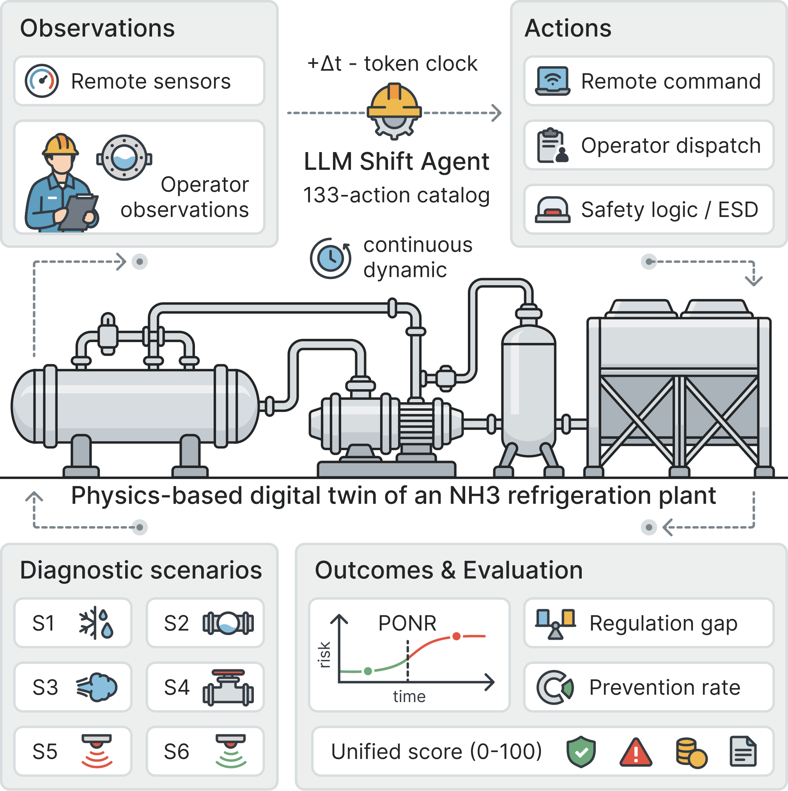
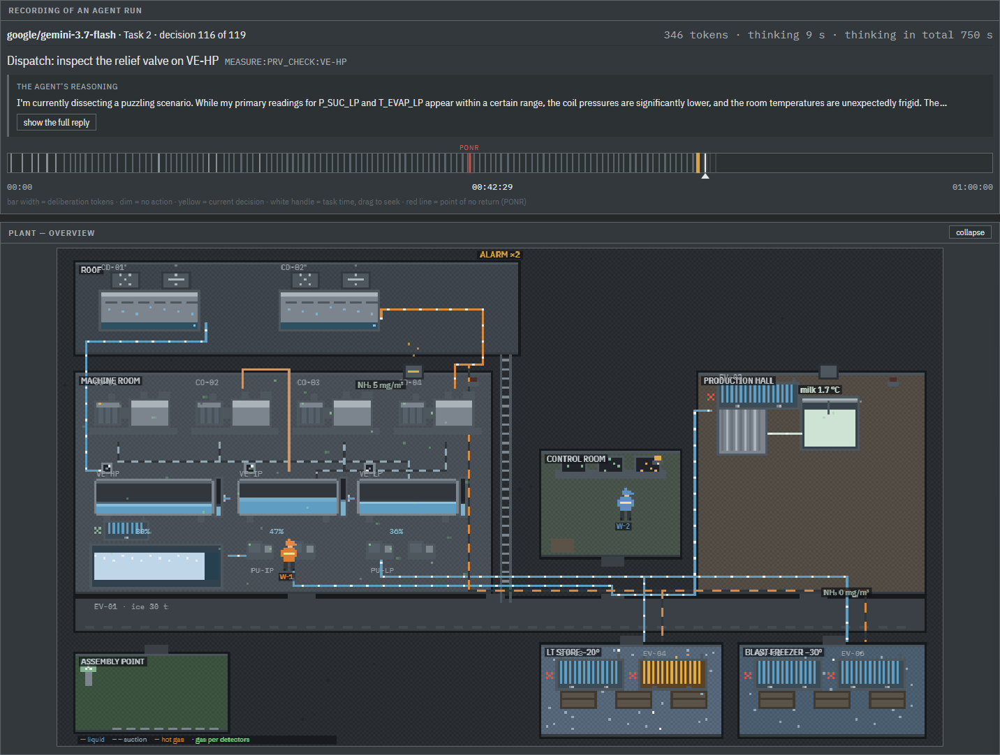

# NH3Bench

A physics-grounded benchmark for LLM agents acting as shift engineers on an industrial
ammonia refrigeration plant. Agents read instruments and issue commands from a fixed
133-action catalog; a digital twin of a dairy's two-stage R717 plant (250 t/day, 4170 kg
charge) decides the consequences.

Three things make it different from scripted operations benchmarks:

- **Accident-forcing** — inaction causes catastrophe, so the metric is prevention, not
  failure rate.
- **The clock never stops** — reasoning tokens convert to virtual seconds (1 token
  ~ 1/40 s), so a slow correct answer can arrive after the rupture. One model died
  mid-thought holding the right answer: it spent 165 virtual seconds writing the
  evacuation order while the gland let go.
- **Partial digitalization** — a third of the truth lives on local gauges and in an
  operator's ears, reachable only by dispatching a human who walks, works, and refuses
  unsafe entry. In most scenarios SCADA disagrees with reality at least once.



## Results — seed 1, six scenarios, nine language models

Unified score 0–100 (catastrophe = 0; people, economics and discipline multiply — see
`docs/METRICS.md`).

| policy | S1 | S2 | S3 | S4 | S5 | S6 | mean | RegGap |
|---|---|---|---|---|---|---|---|---|
| oracle (scripted solution) | 100 | 100 | 100 | 100 | 100 | 100 | 100.0 | +59.0 |
| Fable 5 | 100 | 100 | 80\* | 100 | 78 | 69 | 87.9 | +46.9 |
| Codex Astra (medium) | 100 | 100 | 80 | 100 | 40 | 69 | 81.5 | +40.5 |
| Opus 5 | 100 | 100 | 80\* | 100 | 67 | 0 | 74.6 | +33.6 |
| Codex Sol (medium) | 100 | 0 | 80 | 100 | 62 | 69 | 68.5 | +27.5 |
| GLM-5.3 (maximum) | 0 | 89 | 75 | 68 | 83 | 69 | 64.1 | +23.1 |
| always-ESD | 73 | 95 | 57 | 95 | 57 | 0 | 62.8 | +21.8 |
| Sonnet 5 | 0 | 0 | 80\* | 53 | 84 | 69 | 47.6 | +6.7 |
| Haiku 4.5 | 0 | 95 | 80\* | 0 | 94 | 0 | 44.9 | +3.9 |
| written regulation | 0 | 95 | 57 | 0 | 94 | 0 | 41.0 | — |
| Codex Terra (medium) | 0 | 0 | 75 | 100 | 50 | 0 | 37.5 | −3.5 |
| inaction | 0 | 0 | 80 | 0 | 100 | 0 | 30.1 | −10.9 |
| Codex Luna (medium) | 0 | 0 | 80 | 0 | 30 | 0 | 18.4 | −22.6 |

\* Twin v2.1 (adiabatic wave-speed modulus, corrected superheat density,
sensor faults reaching the panel — `docs/VALIDATION.md`). S2 was re-measured
live on all four Claude models after the sensor fix; the S3 cells are deterministic
replays of the recorded traces under the retuned S3 and await live
re-measurement.

On the fixed S2 — where the level gauge really does freeze and only a
dispatched operator can tell — Opus and Fable still pass clean, Sonnet still
ruptures, and Haiku prevents the catastrophe with a blunt emergency stop it
never justified (95, since an unjustified ESD is charged as damage). That
single cell is what lifts Haiku above the written regulation.

**Regulation Gap** = score minus the published checklist-following policy: an agent that
cannot beat the written regulation scores below zero here regardless of raw prevention.
Two of six scenarios are mirrored controls (S5 punishes over-reaction, S6 punishes
trusting a discredited instrument's dismissal): no model passes both, and the per-scenario
rankings invert — fixed dispositions lose one of the two mirrors.

Terra sensitivity experiments add two cautions to the single-run table. Three independent
model samples at each of the six reasoning levels gave means of 45.97, 50.97, 37.20,
47.27, 43.60, and 41.17 (`none` through `max`). The levels were not distinguishable
(100,000-permutation Kruskal--Wallis: H=2.511, p=0.817), and there was no monotone trend
(Spearman rho=-0.116, permutation p=0.649). Across ten twin seeds at fixed `medium`, the
mean was 42.11 (sample SD
8.21; range 35.1--55.0; exploratory bootstrap 95% CI 37.52--47.26). See
`docs/MODEL-RUNS.md` (sensitivity studies); the seed study measures
end-to-end variability because the model-sampling RNG itself was not fixed. Codex exposes
reasoning effort but not a model-sampling seed, so the three reasoning replicates are
independent stochastic samples with the simulator seed fixed at 1. Five additional
medium-effort samples with that twin seed held fixed averaged 36.92 (sample SD 0.58,
range 36.5--37.6; bootstrap 95% CI 36.50--37.36), showing substantially smaller
observed model-sampling dispersion.

One GLM-5.3 run through Z.AI scored 64.1 (PR 0.833, Regulation Gap +23.1). It prevented
catastrophe in five scenarios but failed S1, leaving its worst-scenario score at zero.
This is a single-run observation; configuration, exact replay verification, and artifact
paths are recorded in `docs/MODEL-RUNS.md`.

Full per-run analysis: `docs/MODEL-RUNS.md` and `docs/CALIBRATION.md`. Per-decision
transcripts with the models' own reasoning: `results/llm_traces/`.



*The demo replaying a recorded run of `google/gemini-3.7-flash` on task S2, stopped at
decision 116 of 119. Top strip: the task clock, the decision being prepared, its price in
deliberation tokens, and the model's own reasoning. Below it the decision timeline — bar
width is the deliberation cost, the red line is the point of no return, already 14 minutes
behind. The plant view shows only what the agent can see: two standing alarms, a worker
dispatched to inspect the relief valve, and the level the frozen transmitter reports.*

The AAAI-27 demonstration-track paper: LaTeX source at
[nicl-nno/nh3bench-paper](https://github.com/nicl-nno/nh3bench-paper).

## Quick start

```bash
python3 -m pip install numpy matplotlib

# reference policies on one scenario
python3 tests/run_baselines.py --scenarios S1 --policies null,oracle --seeds 1

# a Claude agent (needs a signed-in Claude Code CLI)
python3 tests/run_llm.py --scenarios S6 --model haiku

# a Codex agent using the current signed-in subscription
python3 tests/run_llm.py --provider codex --model gpt-5.6-luna \
  --reasoning-effort medium --scenarios S1,S2,S3,S4,S5,S6 \
  --out results/llm_gpt-5.6-luna.jsonl

# the full metric report
python3 tests/report_metrics.py
```

## Evaluate your own model

Any model on OpenRouter, or Claude through the Claude Code CLI. Put
`OPENROUTER_API_KEY=...` in `.env`. Details: `docs/BENCHMARK.md`.

```bash
python -m pip install -r requirements.txt

python benchmark.py run --provider openrouter --model <slug> --scenarios S1
python benchmark.py run --provider openrouter --model <slug>    # all six tasks
python benchmark.py report
```

The run is saved to `results/`, with a per-decision transcript next to it, and the report
prints your model alongside the published rows. Write it to `results/user/` instead and
the demo picks it up as its own category, watchable like any published run:

```bash
python benchmark.py run --provider openrouter --model <slug> --scenarios S1 \
       --out results/user/openrouter.jsonl --trace-dir results/user/traces
```

The task is Russian by default — that is what the published runs answered. `--prompt-lang
en` gives the same task in English (role, catalog, panel and the plant's replies); it is
reported as a separate column, since the model answers a different text.

## Interactive demo

One self-contained HTML file, opened straight from disk. `EN`/`RU` in the header.

The file is **not in the repository** — it is a build artifact (2 MB, rebuilt from
scratch on every change), so you produce it locally:

```bash
python -m pip install -r requirements.txt
python trainer/make_snapshots.py      # once, ~4 min: start each task instantly
python trainer/build_trainer.py       # -> trainer/nh3bench-demo.html
```

Then open `trainer/nh3bench-demo.html` in a browser — no server, no build step. The
first launch downloads the Python runtime (~15 MB) once, and after that the whole
simulator runs locally in the page. Snapshots are optional: without them every task
start costs a full plant warm-up, which takes minutes in a browser.

- **Watch** — any recorded run, replayed through the same twin the models faced; the
  panel keeps living while the model thinks. Click a decision to see what the model saw
  and what it answered.
- **Compare** — the score matrix; a cell marked ▸ opens that run. *Compare decisions*
  puts two runs of one task side by side, aligned by their command sequences, so you can
  see where they diverged and whether that was before or after the point of no return.
- **Take the task yourself** — the six tasks on the models' terms, plus a *quick try* of
  task 1 at the end of the list: three or four choices instead of the full catalog, about
  two minutes, and marked as a try rather than a result. A progress strip under the
  header shows how much of the task is left, *play out with no further action* runs the
  remaining time out in seconds (useful for a demo when you already know the answer), and
  *back to tasks* leaves at any moment without recording a result.

Your own result can be added to the results table under an experiment name, and is scored
by the same function as the published rows. It is kept in your browser only, marked as
yours, and deletable; a quick try and a hand-stopped task are marked and left out of the
mean.

The table keeps three categories apart: the published matrix, runs you measured yourself
(`results/user/`), and runs played in this browser.

## Generated artifacts

Two HTML deliverables are build outputs, not committed — regenerate rather than hand-edit.
Each is a single self-contained file (inline CSS/JS/base64 assets).

```bash
python3 trainer/make_snapshots.py     # once, ~4 min: task start states
python3 trainer/build_trainer.py      # -> trainer/nh3bench-demo.html (~3.3 MB)

python3 viz/expert_data.py            # runs the twin -> viz/expert_data.json
python3 viz/expert_figs.py            # matplotlib -> viz/expert_figs.json (base64 PNG)
python3 viz/build_expert_doc.py       # -> viz/nh3bench-expert-guide.html (~750 KB)
```

The demo is the trainer plus Watch, Compare and the quick try, in English or Russian. The
expert guide is written for a plant operator validating realism: briefing, planted faults,
timeline under inaction, correct actions, typical errors, questions for the expert — and
every curve in it comes from an actual simulation run, so retuning a scenario means
rebuilding the figures or the document lies.

## Documentation

| File | Contents |
|---|---|
| `CLAUDE.md` | working context: invariants, conventions, workflows, gotchas |
| `docs/ARCHITECTURE.md` | module map, state vector, key APIs |
| `docs/SCENARIOS.md` | scenario mechanisms, traps, solutions |
| `docs/CALIBRATION.md` | method, acceptance criteria, current matrix, per-model runs |
| `docs/VALIDATION.md` | twin validation plan, data inventory, findings |
| `docs/VALIDATION-REPORT-ru.md` | physics-model validation report (Russian): data, findings, fixes, results |
| `docs/BENCHMARK.md` | how to evaluate your own model: task, timing, running, reporting |
| `docs/METRICS.md` | the metric set, the unified score, and what it does not mean |
| `docs/MODEL-RUNS.md` | how every published run was made and verified, what it did, and the sensitivity studies |
| `docs/DECISIONS.md` | why things are the way they are; the twin's known simplifications |

Code comments and documentation are in English. The plant's own language stays Russian by
design — the 133 command names, the plant's replies, the observation text and the task
briefings are the canonical task the published runs answered, and the expert-facing
artifacts are written for the validating ammonia-plant operator. The demo interface is
bilingual: English is substituted over the Russian labels, so nothing is lost either way.

> The previous NH3Bench (a single-suction telemetry-control benchmark with a Haiku
> reference agent) is preserved in this repository's git history prior to this tree.
